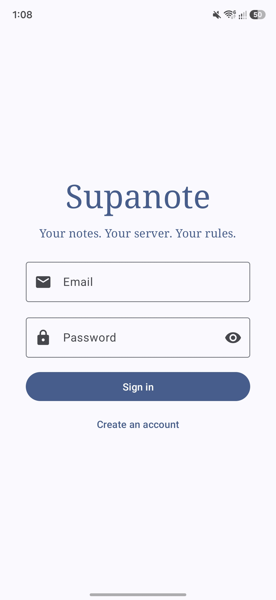
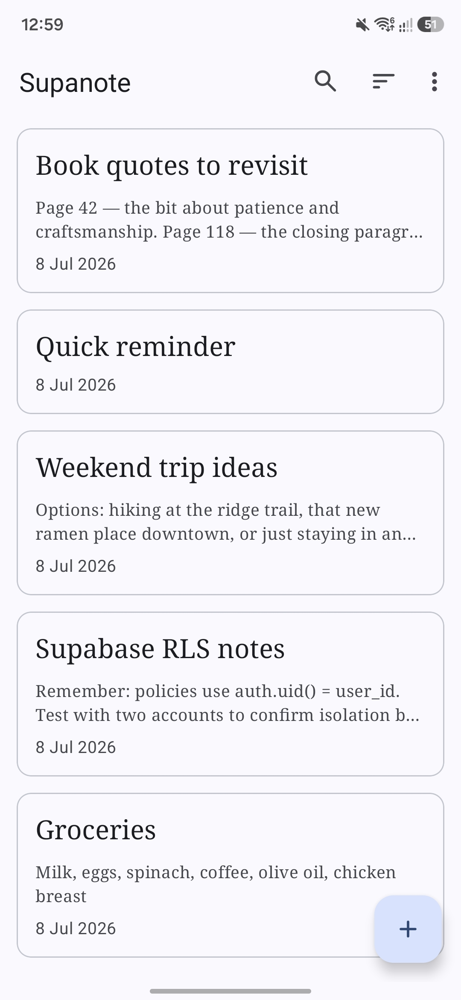
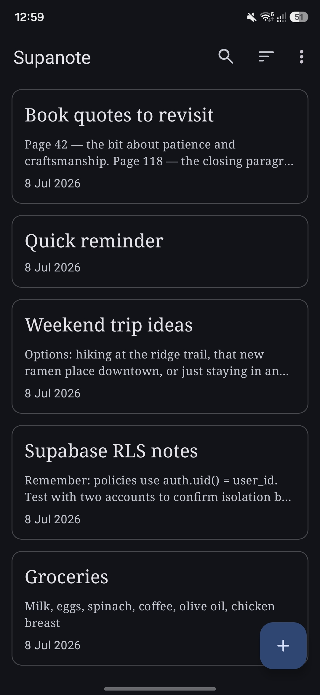
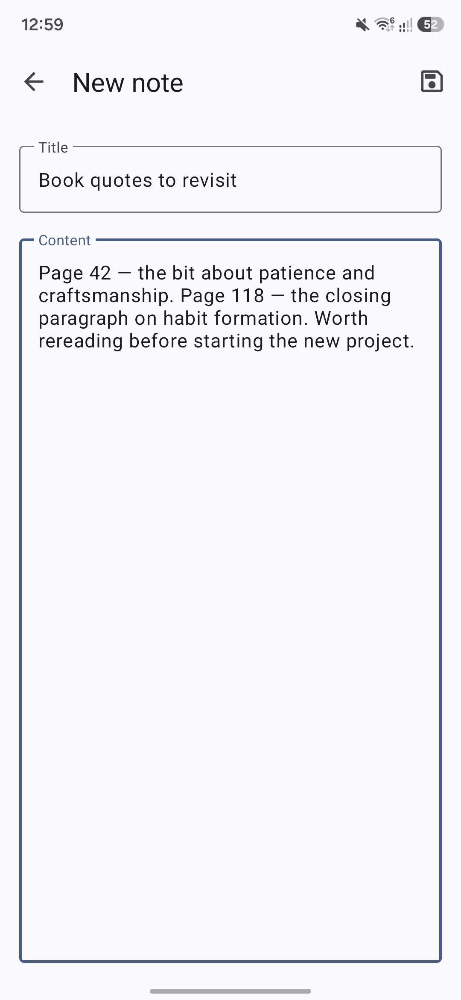
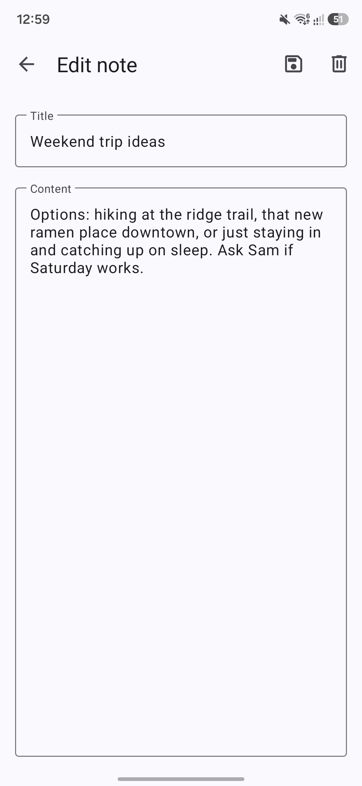
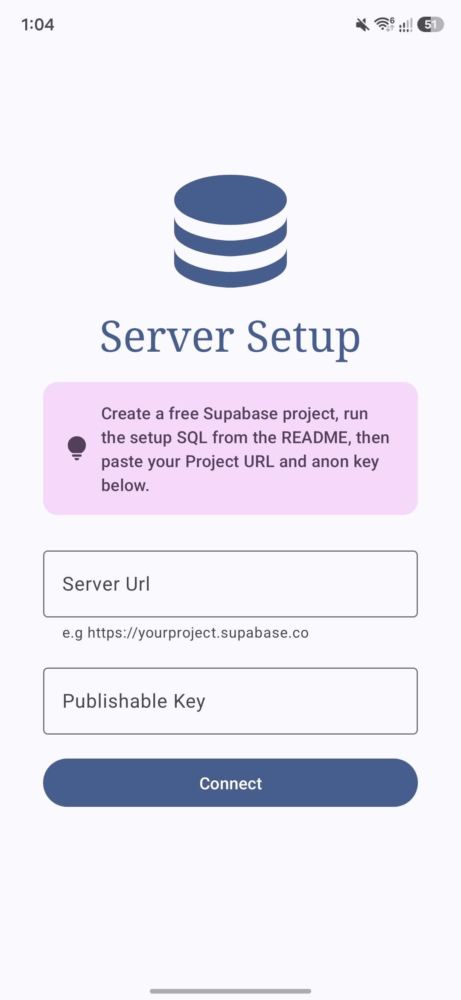

<div align="center">


# Supanote

**Your notes. Your server. Your rules.**

Supanote is a simple, open-source notes app that connects to your own Supabase backend instead of a company's servers. Whether you're using a free Supabase Cloud project or a self-hosted instance, your notes live where you decide — not locked into someone else's platform.

</div>

## Features

* **Free and Open Source:** Enjoy complete transparency and community-driven development.
* **Bring Your Own Backend:** Connect to any Supabase project — Cloud or self-hosted — by entering your project URL and key on first launch. Nothing is hardcoded or tied to one server.
* **No Vendor Lock-In:** Switch servers anytime from Settings without reinstalling the app.
* **Private by Default:** Each account only ever sees its own notes, enforced by Row Level Security on the database itself.
* **Secure Session Storage:** Login sessions are kept in encrypted on-device storage, with automatic token refresh so you stay signed in.
* **Search:** Quickly filter your notes by title or content from the toolbar.
* **Flexible Sorting:** Organize your notes by newest, oldest, or title.
* **Data Management:** Export your notes to a JSON file and import them back in, so your data is always yours to keep.
* **Dedicated Editor:** A focused, full-screen screen for writing and editing notes, with a discard-changes safeguard so you never lose work by accident.
* **Crash Reports:** If the app encounters an unexpected error, a dialog on the next launch lets you send the crash details by email or save them to a file.

## Screenshots

<div align="center">
	<div>
	
    
    
	
    
    
	</div>
</div>

## Requirements

* Android 10 (API 29) or later.
* A Supabase backend — either a free [Supabase Cloud](https://supabase.com) project or your own self-hosted instance.

## Getting Started

Supanote needs a Supabase backend to talk to. Setting one up takes a few minutes:

1. Create a free project at [supabase.com](https://supabase.com) (or run your own self-hosted instance).
2. Open the **SQL Editor** and run [`schema.sql`](schema.sql) from this repo to create the `notes` table and its Row Level Security policies.
3. Under **Authentication → Sign In / Providers**, enable **Email**.
4. Grab your **Project URL** and **anon / publishable key** from **Settings → API Keys**.
5. Open Supanote, paste in your URL and key on the setup screen, then create an account.

You can change servers anytime from **Settings → Change server**.

## Verification

APK releases on GitHub are signed using my key. They can
be verified using
[apksigner](https://developer.android.com/studio/command-line/apksigner.html#options-verify):

```
apksigner verify --print-certs --verbose supanote.apk
```

The output should look like:

```
Verifies
Verified using v1 scheme (JAR signing): false
Verified using v2 scheme (APK Signature Scheme v2): true
Verified using v3 scheme (APK Signature Scheme v3): false
Verified using v3.1 scheme (APK Signature Scheme v3.1): false
Verified using v3.2 scheme (APK Signature Scheme v3.2): false
Verified using v4 scheme (APK Signature Scheme v4): false
```

The certificate fingerprints should correspond to the ones listed below:

```
Owner: CN=Mowtiie
Issuer: CN=Mowtiie
Serial number: 8a256fdcdde50069
Valid from: Wed Jun 10 22:57:23 PST 2026 until: Sun Oct 26 22:57:23 PST 2053
Certificate fingerprints:
         SHA1: 56:4E:2C:DB:E4:06:C9:EC:15:E6:BC:D9:0A:88:38:72:8B:FB:13:20
         SHA256: 8B:67:51:F3:C3:31:85:63:5F:98:95:30:B6:C0:73:A1:39:7B:3D:41:2B:EF:AE:69:06:A2:EB:58:45:D2:DE:63
```

**Warning:** Only install Supanote APKs signed with the key above. Verifying the signature confirms you're running a genuine, unmodified build.

### PGP Signing

As an additional layer on top of the Android signature above, each release is also signed with my PGP key. While `apksigner` confirms the APK itself is intact, a PGP signature confirms that *I* am the one who published this specific file to GitHub — an independent check that doesn't rely on GitHub's account security alone.

**Public key fingerprint:**
```
9EA2 8F46 7802 5092 7643 1B69 42B5 FA42 AA63 90E1
```

Download and import the key from my website, or directly from this repo:

```
curl -O https://mowtiie.cc/PGP_PUBLIC_KEY.asc
gpg --import PGP_PUBLIC_KEY.asc
```

After importing, confirm the fingerprint printed by GPG matches the one listed above — that match is what actually establishes trust, not the import step itself. Fetching the key over HTTPS from a domain you already trust is arguably a stronger anchor than a keyserver, since keyservers accept uploads from anyone and don't vouch for identity.

Each release includes a detached `.asc` signature alongside the APK. Verify a downloaded release with:

```
gpg --verify supanote-vX.X.apk.asc supanote-vX.X.apk
```

A valid signature looks like:

```
Good signature from "Mowtiie <mowtiie.dev@gmail.com>"
```

**Note:** PGP signing is a supplementary trust measure, not a substitute for the `apksigner` check above — verify both if you want the highest confidence that a release is genuine and unmodified.

## Mapping Files

Each release on GitHub includes a `mapping-<version>.txt` file alongside the APK. This file is needed to deobfuscate stack traces from crash reports — match the file to the version shown in the crash report header and use it with `retrace` from the Android SDK.

## Building from Source

`local.properties` can optionally hold `SUPABASE_URL` and `SUPABASE_KEY`, which pre-fill the setup screen during development so you're not retyping your own test project's credentials on every install. These are read into `BuildConfig` at build time.

**Before building a release APK, make sure `local.properties` is empty or removed.** Anything left in it gets compiled directly into `BuildConfig` — and into the APK. A release built with your personal project's URL and key would ship those credentials to everyone who installs it, defeating the entire point of a bring-your-own-backend app. `local.properties` is git-ignored by default and should never be committed, but that doesn't stop it from being baked into a build you distribute.

## Contributing

Issues and pull requests are welcome. If you're filing a bug, please include your Android version and the steps to reproduce.

## License

This project is licensed under the GNU General Public License v3.0. See the
[LICENSE](LICENSE) file for details.
